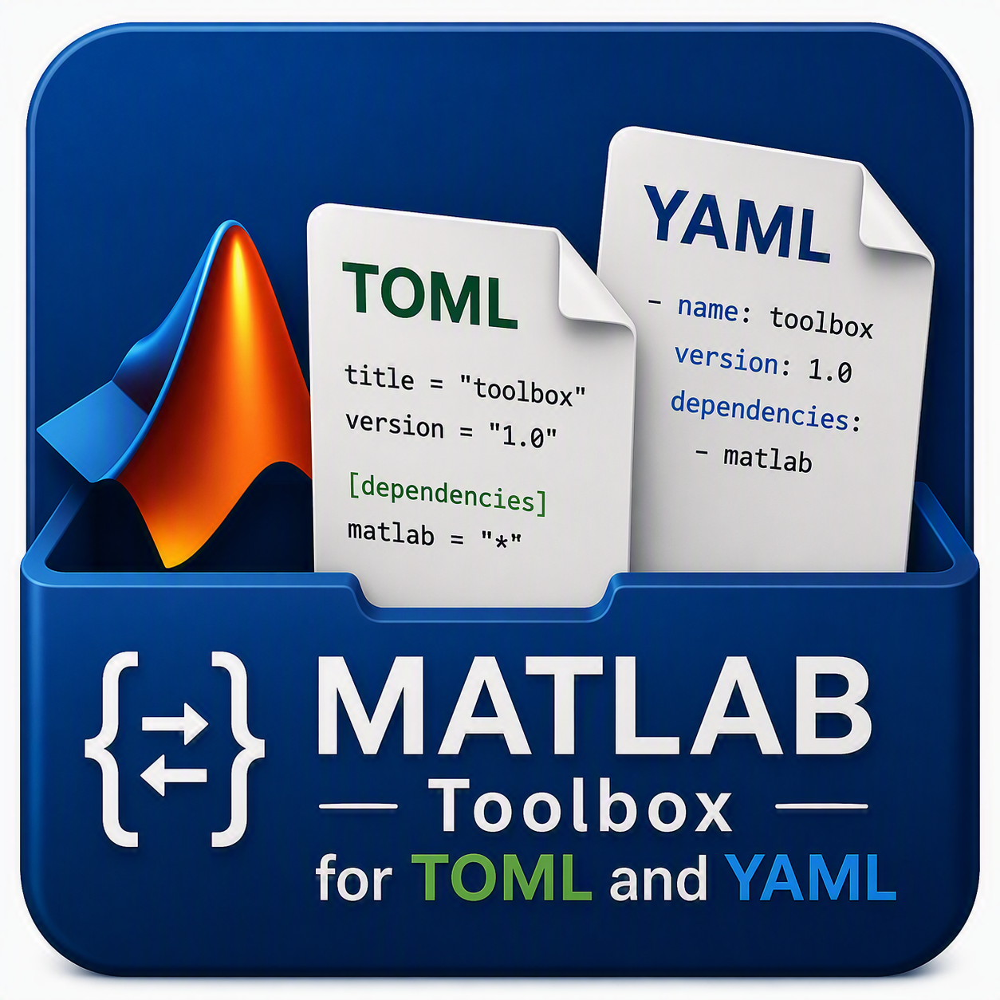

# MATLAB Toolbox for TOML and YAML

The MATLAB&reg; Toolbox for TOML and YAML adds support for reading and writing YAML and TOML configuration files with very strong round-trip support. The toolbox includes custom data types that make it easier to work with YAML and TOML data than structures or tables. The implementation is pure MATLAB with no third-party dependencies.



[](https://matlab.mathworks.com/open/github/v1?repo=mathworks/matlab-toml-yaml)
[](https://www.mathworks.com/matlabcentral/fileexchange/184722-matlab-toolbox-for-toml-and-yaml)

## Features

- **YAML & TOML Support** - Read and write both formats with consistent interface
- **Dot Notation Access** - Natural MATLAB syntax: `config.database.host`
- **Special Characters** - Handle keys with hyphens, spaces: `config.("build-system")`
- **Full Round-Trip** - Read, modify, write back without data loss
- **Implicit Type Conversion** - Automatic conversion to optimal MATLAB types
- **Flexible File Writing** - Control formatting, indentation, array styles

## Installation

Download the latest `.mltbx` file from [Releases](https://github.com/mathworks/matlab-toml-yaml/releases). Open the file, or install programmatically:

```matlab
matlab.addons.toolbox.installToolbox("MATLAB_Toolbox_for_TOML_and_YAML.mltbx")
```

## Quick Start

### Reading Files

```matlab
% Read YAML
config = readyaml("server_config.yaml");
host = config.database.host;

% Read TOML
project = readtoml("simple_project.toml");
name = project.project.name;

% Keys with special characters
deps = project.("build-system").requires;
```

### Writing Files

```matlab
% Create data
config = yamldata();
config.name = "MyApp";
config.database.host = "localhost";
config.database.port = 5432;

% Write YAML
writeyaml(config, "my_config.yaml");

% Write TOML
writetoml(config, "my_config.toml");
```

## Main Functions

### YAML
- [`readyaml`](toolbox/doc/readyaml.md) - Read YAML file 
- [`writeyaml`](toolbox/doc/writeyaml.md) - Write YAML file
- [`yamldata`](toolbox/doc/YAMLData.md) - Create `matlab.io.config.YAMLData` datatype
- [`matlab.io.config.YAMLData`](toolbox/doc/YAMLData.md) - Struct-like datatype for YAML 

### TOML
- [`readtoml`](toolbox/doc/readtoml.md) - Read TOML file
- [`writetoml`](toolbox/doc/writetoml.md) - Write TOML file
- [`tomldata`](toolbox/doc/TOMLData.md) - Create `matlab.io.config.TOMLData` datatype
- [`matlab.io.config.TOMLData`](toolbox/doc/TOMLData.md) - Struct-like datatype for TOML

## Examples

See [`toolbox/doc/GettingStarted.mlx`](toolbox/doc/GettingStarted.mlx) for an introductory walkthrough, or explore the `toolbox/examples/` folder:

**YAML Examples:**
- [`readyamlExample.m`](toolbox/examples/readyamlExample.m) - Reading YAML files
- [`writeyamlExample.m`](toolbox/examples/writeyamlExample.m) - Writing YAML files
- [`yamlWorkflowExample.m`](toolbox/examples/yamlWorkflowExample.m) - End-to-end read/modify/write workflow

**TOML Examples:**
- [`readtomlExample.m`](toolbox/examples/readtomlExample.m) - Reading TOML files
- [`writetomlExample.m`](toolbox/examples/writetomlExample.m) - Writing TOML files
- [`tomlPyprojectExample.m`](toolbox/examples/tomlPyprojectExample.m) - Working with `pyproject.toml`

**Demo Scripts:**
- [`conversionExample.m`](toolbox/examples/conversionExample.m) - Converting between structs, dictionaries, containers.Map, and data objects

## Limitations

This toolbox implements a simplified YAML parser optimized for configuration files. It is **not** a full YAML 1.2 compliant parser.

- **YAML**: Subset parser. See [readyaml documentation](toolbox/doc/readyaml.md#limitations) for details on supported/unsupported features (anchors, tags, etc.). Being addressed in the [cpp-parser-serializer](https://github.com/mathworks/matlab-toml-yaml/tree/cpp-parser-serializer) branch.

## Requirements

- MATLAB R2022b or later (for `dictionary` with value semantics)
- No additional toolboxes required

## License

Copyright 2026 The MathWorks, Inc. See [LICENSE](LICENSE) for details.

## Contributing

See [CONTRIBUTING.md](CONTRIBUTING.md) for guidelines on building source code, submitting issues, and pull requests.

---
